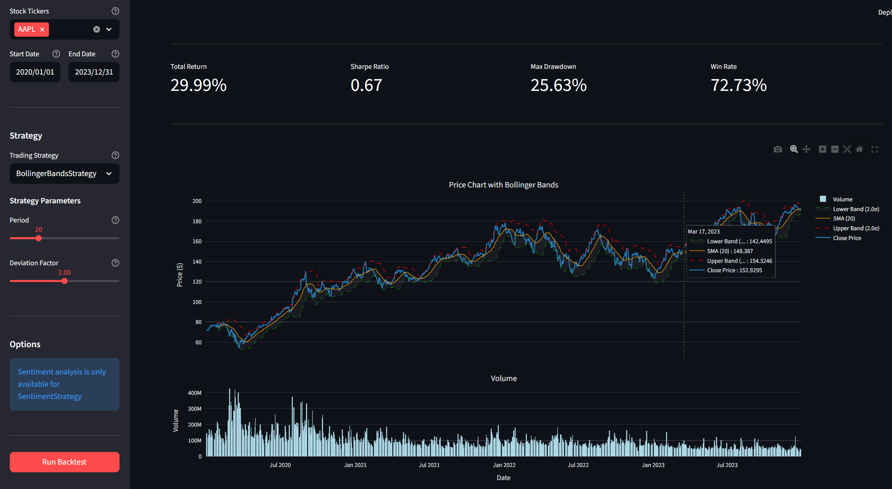

# MCP Backtesting Dashboard

A modular dashboard for equity strategy backtesting, integrating market data, news sentiment analysis, and strategy performance insights using a multi-adapter architecture.

## 


### Strategy Visualization
Interactive charts with several technical indicators.



### Strategy Insights & Analysis
Comprehensive performance analysis with intelligent insights and visualizations.


## Features

- Multi-source data integration (market prices via yfinance, news scraping)
- Sentiment analysis integration
- Backtesting engine with Backtrader
- Pre-built trading strategies
- Strategy performance insights
- Interactive Streamlit dashboard

## Setup

### Prerequisites

- Python 3.8 or higher
- pip (Python package manager)

On WSL/Ubuntu, install python3-venv if needed:
```bash
sudo apt install -y python3.12-venv python3-pip
```

### Installation

```bash
# Create virtual environment
python3 -m venv venv

# Activate virtual environment
source venv/bin/activate

# Install dependencies
pip install -r requirements.txt
```

### Configuration

Create a `.env` file for OpenAI API integration:
```bash
cp .env.example .env
```

Edit `.env` and add your OpenAI API key:
```
OPENAI_API_KEY=your_actual_api_key_here
```

## Usage

Activate the virtual environment:
```bash
source venv/bin/activate
```

Run the Streamlit dashboard:
```bash
streamlit run app.py
```

## Project Structure

```
├── app.py                 # Main Streamlit application entry point
├── requirements.txt       # Python dependencies
├── .env.example          # Environment variables template
│
├── adapters/              # Data source adapters
│   ├── yfinance_adapter.py
│   ├── news_adapter.py
│   └── sentiment_adapter.py
│
├── strategies/            # Trading strategies
│   └── prebuilt.py
│
├── backtest/              # Backtesting engine
│   └── engine.py
│
├── llm/                   # LLM integration
│   └── openai_client.py
│
├── utils/                 # Utility modules
│   ├── data_fetchers.py   # Data fetching orchestration
│   └── ui_components.py   # UI rendering components
│
├── config/                # Configuration files
│   └── static_flows.py    # Pre-configured demo scenarios
│
├── tests/                 # Test files
│   ├── test_adapters.py
│   ├── test_engine.py
│   ├── test_openai.py
│   └── ...
│
└── images/                # Screenshots and assets
    ├── BacktestDash-Home.png
    ├── BacktestDash-Bollinger.png
    └── BacktestDash-StrategyInsights.png
```


## Dependencies

- Market data: yfinance
- Backtesting: Backtrader
- News scraping: BeautifulSoup, requests
